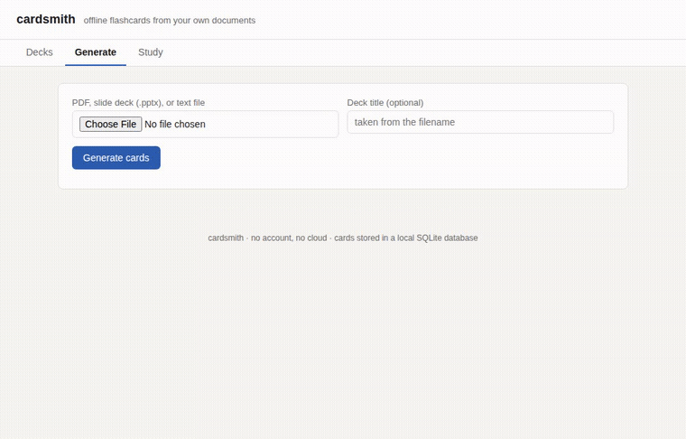

# cardsmith

Offline flashcards. Drop a PDF, a slide deck, or a text file, get a spaced-repetition
deck built by a local LLM, study it in the browser, export to Anki. No account, no
cloud, nothing leaves your machine.



On a 3,248-word public-domain biology chapter, cardsmith generated 152 cards in
775.5 seconds. Its mechanical source-quote check matched 142 of 152 cards to an
exact substring of the input. A 40-card hand rating against the source text
found 37 factually accurate, 1 inaccurate, and 2 unusable, for 92.5 percent
accuracy.[^bench]

[^bench]: Source: Project Gutenberg ebook #39969, *A Civic Biology, Presented in
    Problems* by George W. Hunter (1914), Chapter IV, "The Functions and Composition
    of Living Things" (3,248 words). Model: `qwen3:4b` through Ollama's native
    `/api/chat`, `think: false`. Hardware: MacBook Air M5, 24 GB unified memory, one
    Ollama process. The benchmark recorded generation time, counts, and exact quote
    matches. Results and raw cards are in `eval/`. Measured 2026-09-30.

[](https://github.com/Arthur031221/cardsmith/actions/workflows/ci.yml)
[](LICENSE)
[](CHANGELOG.md)

## Why

Quizlet offers paid tiers and stores synced notes on its servers.
Making flashcards by hand from a chapter of reading is slow enough that most people
skip it and re-read instead, which is a worse way to study. The AI tools that exist
either need an account and a subscription, or they generate cards with no way to
check them against the source text before you start memorizing something wrong.
cardsmith runs entirely on your machine: the LLM, the scheduler, and the database.

## Install

```
uvx --from git+https://github.com/Arthur031221/cardsmith cardsmith
```

This starts the local web UI and opens it in your browser. It needs
[Ollama](https://ollama.com) running with `qwen3:4b` pulled to generate cards:

```
ollama pull qwen3:4b
```

Studying existing decks and exporting to Anki work even without Ollama running.

## Quick start

1. `ollama pull qwen3:4b` (once)
2. `uvx --from git+https://github.com/Arthur031221/cardsmith cardsmith`
3. In the browser tab that opens, go to **Generate**, pick a PDF, `.pptx`, or `.txt`
   file, and click **Generate cards**.
4. Edit any card in the preview, or delete the ones you do not want.
5. Click **Save deck**, then **Study** to review it, or **Export .apkg** to load it
   into Anki.

## How it works

- **Ingest**: `pymupdf` extracts text per PDF page, `python-pptx` extracts text per
  slide (including speaker notes), plain text and Markdown files are split by
  paragraph. Small adjacent pages or paragraphs are merged and long ones are split, so
  each chunk sent to the model is 120 to 900 words.
- **Generate**: each chunk goes to Ollama's native `/api/chat` (not its
  chat-completions compatibility endpoint, which was found to ignore `think: false`
  for qwen3 models and burn the output budget on hidden reasoning) with `think: false` and a
  JSON schema passed as `format`, so the reply is always parseable. The model is told
  to use only facts in the chunk and to attach a verbatim `source_quote` to every
  card. cardsmith checks whether that quote is actually a substring of the chunk and
  flags the card in the preview if it is not, rather than trusting the model's claim.
- **Preview**: generated cards are not written to the database until you click
  **Save deck**. Everything in the preview is editable first.
- **Study**: a plain SM-2 scheduler (SuperMemo 2, the same algorithm Anki started
  from) in SQLite. Four grade buttons (Again, Hard, Good, Easy) map to SM-2 quality
  scores of 1, 3, 4, and 5.
- **Export**: `genanki` builds a `.apkg` with a Basic note type and a Cloze note type.
  Deck and note model ids are derived deterministically from the database deck id, so
  exporting the same deck twice updates it in Anki instead of creating a duplicate.

## Comparison

| | cardsmith | [quenti](https://github.com/quenti-io/quenti) | [AnkiAIUtils](https://github.com/thiswillbeyourgithub/AnkiAIUtils) | [QuizFlow](https://github.com/douxxtech/QuizFlow) | Quizlet |
|---|---|---|---|---|---|
| Runs offline | yes | no, cloud web app | no, calls a cloud LLM API | no, cloud web app | no |
| Generates cards from a document | PDF, PPTX, text | manual entry only | Anki add-on, works on existing notes | manual entry only | PDF/notes import (cloud, paid tiers) |
| Native Anki export | `.apkg` via genanki | no | is an Anki add-on | no | no |
| Source quote per card | yes, with a verbatim check | no | no | no | no |
| Spaced repetition | SM-2, built in | its own scheduler | uses Anki's | none found | Quizlet's own |
| Account required | no | yes (hosted) | no (runs inside Anki) | yes (hosted) | yes |
| Price | free, local compute only | free, self-host or hosted | free | free | paid tiers |
| GitHub stars (2026-09-30) | new | 474 | 882 | 43 | n/a |

quenti is a well-built cloud app, not something you run offline. AnkiAIUtils is the
closest in spirit but is an Anki add-on that improves existing notes with a cloud LLM
call rather than building a deck from a source document. QuizFlow is a small manual
flashcard app with no generation step. None of the three write a verbatim source
quote onto the card or check it against the text.

## Reference

```
cardsmith [--host HOST] [--port PORT] [--db PATH] [--ollama-url URL]
          [--model NAME] [--cards-per-chunk N] [--no-browser]
          [--check] [--json] [--version]
```

- `--host` bind host, default `127.0.0.1`
- `--port` bind port, default `8420`
- `--db` SQLite database path, default `~/.cardsmith/cardsmith.db`
- `--ollama-url` Ollama server URL, default `http://localhost:11434`
- `--model` model for card generation, default `qwen3:4b`
- `--cards-per-chunk` cards requested per text chunk, default `4`
- `--no-browser` do not open a browser tab on start
- `--check` check the Ollama connection and exit instead of starting the server
- `--json` with `--check`, print the result as JSON

### API

The web UI is a thin client over a JSON API on the same port:

- `POST /api/generate` (multipart file + optional title) returns draft cards
- `POST /api/decks` saves a deck
- `GET /api/decks`, `GET /api/decks/{id}` list decks and their cards
- `PUT /api/decks/{id}/cards/{card_id}`, `DELETE /api/decks/{id}/cards/{card_id}`
- `GET /api/decks/{id}/study/next`, `POST /api/decks/{id}/study/{card_id}` with
  `{"quality": 0-5}` to record a review
- `GET /api/decks/{id}/export` downloads the `.apkg`

## Limits and FAQ

- Card quality depends on the source text and on `qwen3:4b`. It is a 4B model: it
  occasionally paraphrases a quote instead of copying it verbatim, which is why every
  card is flagged with a grounded/not-grounded check rather than presented as always
  correct. Larger models pulled into Ollama (pass `--model`) generally do better.
- One generation run is capped at 60 chunks (roughly a 40 to 60 page document at the
  default chunk size) to keep a single request from running for a very long time on
  shared hardware. Split larger documents.
- No OCR. A scanned PDF with no text layer will extract no text. Run it through an
  OCR tool first.
- No image cards, no audio.
- Single user, single machine. There is no sync between devices and no login, by
  design.
- Card generation needs Ollama reachable with the model pulled. Studying and
  exporting decks that already exist do not.
- Factual accuracy was hand-rated at 92.5 percent on the 40-card sample (see
  [eval/results.md](eval/results.md)). An exact source quote checks
  provenance, not whether the question and answer are correct: the errors
  found were a merged fact from two unrelated source lines and a cloze card
  whose answer word was still visible outside the blank.

## Related projects

- [papercompass](https://github.com/Arthur031221/papercompass): Recommends papers from your own library the way cardsmith turns your own PDFs into cards, both local-first.
- [labexplain](https://github.com/Arthur031221/labexplain): Same shape: a PDF in, a local model does the extraction, nothing leaves your machine.
- [snipmd](https://github.com/Arthur031221/snipmd): If a source PDF has an equation cardsmith's cards would mangle, snip it separately and paste the LaTeX in.

## Contributing

See [CONTRIBUTING.md](CONTRIBUTING.md).

## License

MIT, see [LICENSE](LICENSE).
